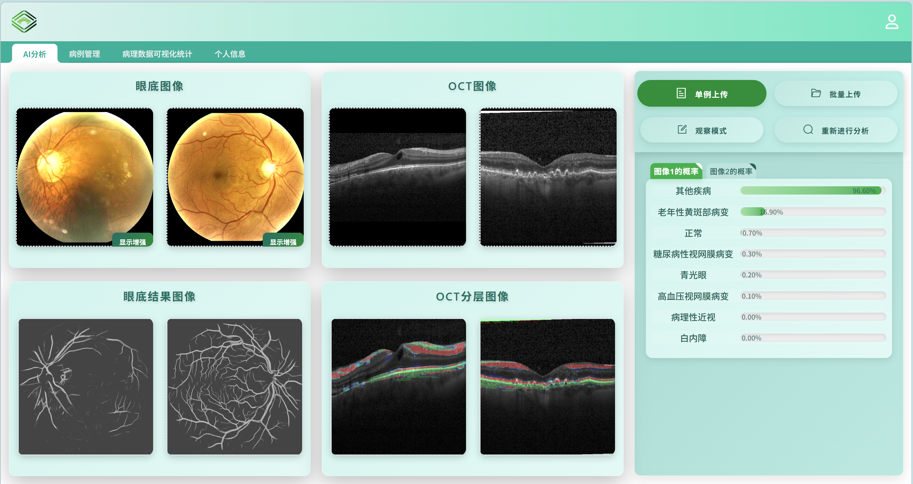
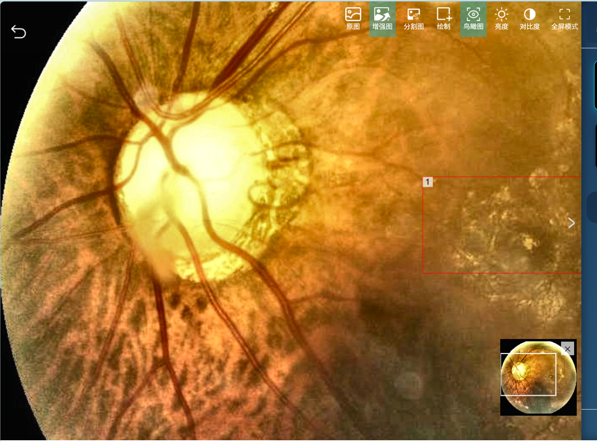
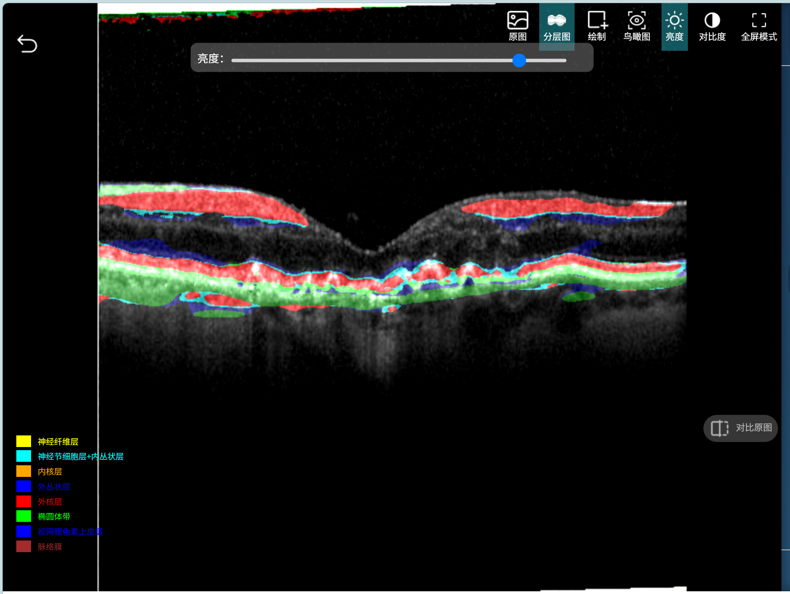
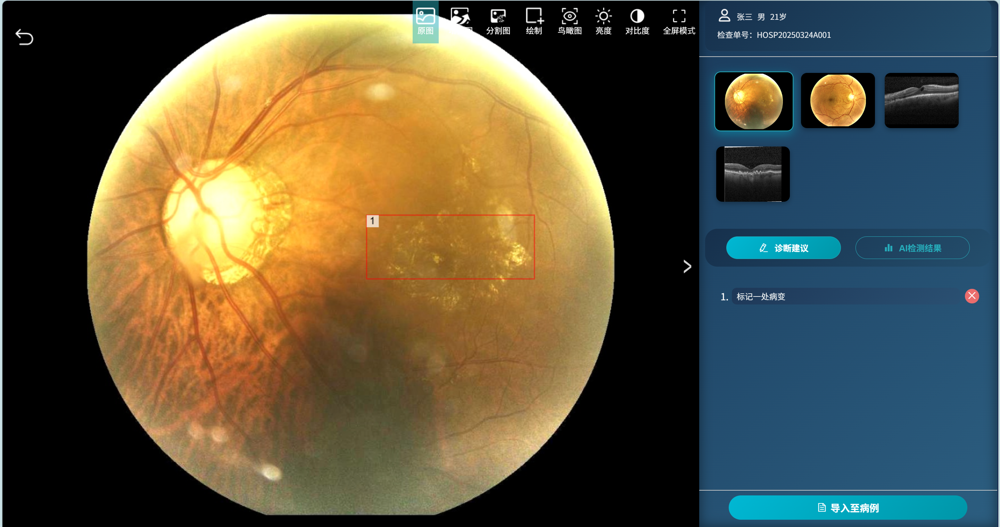
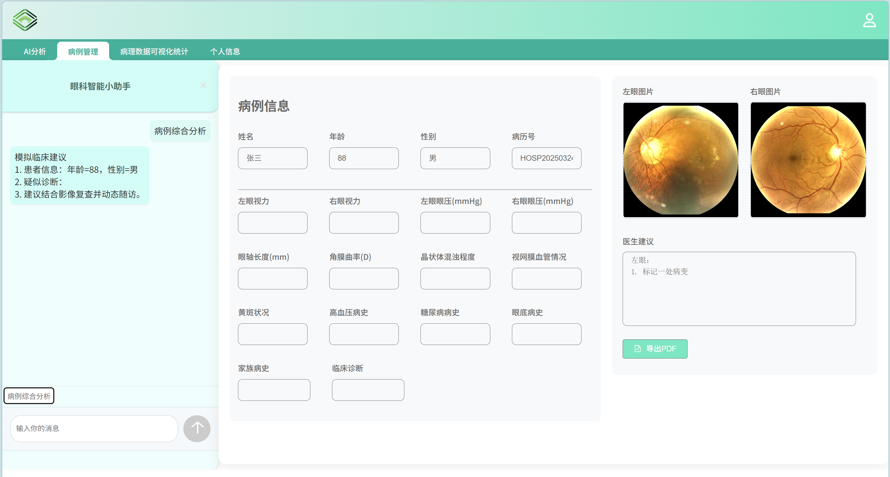
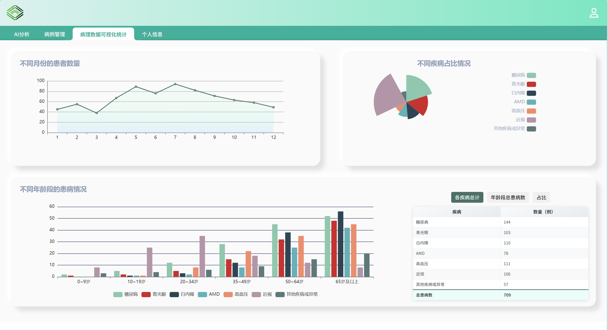
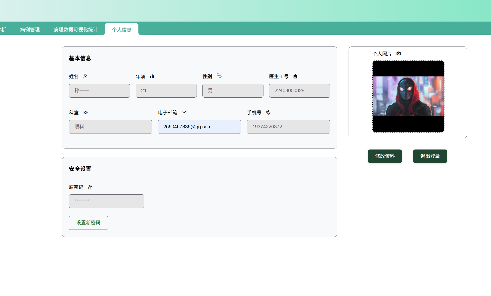

# 智慧眼疾诊断系统

一个用于眼科辅助诊断的前后端分离项目，支持眼底图像分析、OCT 分层、病例管理与统计可视化。

## 项目简介

一个面向眼科辅助诊断场景的智能系统，目标是在“诊断效率”和“临床可解释性”之间取得平衡。系统围绕真实就诊流程设计，整合眼底图像分析、OCT 分层、病灶标注、病例管理、PDF 报告导出与统计可视化，形成从“图像上传 -> AI 分析 -> 医生复核 -> 病例归档 -> 数据统计”的闭环体验。

项目支持浏览器端完整演示：模型服务可用时返回真实分割图和概率结果；模型不可用时自动回退到 Mock 数据，确保演示稳定、流程完整，便于部署与移植。


## 技术选型

1. **前端框架选择**：使用 Vue 2 + Vue Router 构建单页应用，配合 Element UI 完成业务表单、上传与交互组件开发。
2. **数据请求与接口管理**：使用 Axios 统一封装 API 调用，前端通过 Mock/桥接服务对接后端与模型接口，支持真实模型与演示数据双模式切换。
3. **可视化方案选型**：使用 ECharts 实现折线图、饼图、柱状图联动展示，覆盖月度趋势、疾病占比和年龄段分布等核心统计场景。
4. **后端与数据层选择**：使用 FastAPI 提供业务接口，MySQL 存储结构化业务数据，Redis 处理缓存与高频访问场景。
5. **模型服务选型**：使用 Flask + PyTorch 提供推理服务，结合 OpenCV、Pillow 完成图像预处理与结果后处理，支持眼底分割与 OCT 分层任务。

## 演示

- 眼底血管分割与 OCT 分层输出
  <p align="center"></p>

- 图像增强/对比/亮度  
  <p align="center">
    
    
  </p>

- 支持医生在前端进行病灶标注 
  <p align="center"></p>

- 病例导出前触发 AI 分析流程  
  <p align="center"></p>

- 病例统计图表和表格联动
  <p align="center"></p>

- 医生信息维护  
  <p align="center"></p>

## 项目部署

### 安装前端依赖

```powershell
cd 前端
npm install
```

### 启动模型服务（开发模式）

```powershell
conda activate eye-model
cd 模型
python app.py
```

### 启动 Mock / 桥接服务

```powershell
cd 前端
node mock-server.js
```

### 启动前端开发服务（热更新）

```powershell
cd 前端
npm run serve
```

### 前端生产构建

```powershell
cd 前端
npm run build
```

### 代码检查

```powershell
cd 前端
npm run lint
```
